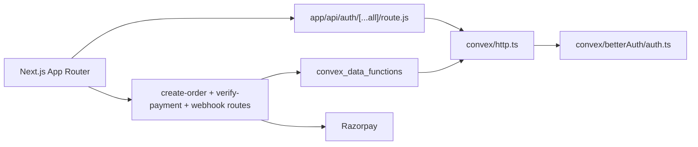

# Citius Travel - Backend Infrastructure (Convex)

## Architecture Overview

The backend now runs on Convex with BetterAuth integrated through the Convex BetterAuth component.

## Core Stack

| Area | Technology |
| --- | --- |
| Auth runtime | BetterAuth + `@convex-dev/better-auth` |
| Auth proxy in Next.js | `convexBetterAuthNextJs` helpers |
| App database | Convex tables (`userProfiles`, `trips`, `bookings`) |
| Payments | Razorpay |
| CMS content | Sanity |

## Important Files

- `convex/auth.config.ts`
- `convex/betterAuth/auth.ts`
- `convex/betterAuth/adapter.ts`
- `convex/http.ts`
- `convex/schema.ts`
- `convex/auth.ts`
- `convex/userProfiles.ts`
- `convex/bookings.ts`
- `convex/migrations.ts`
- `src/lib/auth-client.js`
- `src/lib/auth-server.js`
- `src/app/api/create-order/route.js`
- `src/app/api/verify-payment/route.js`
- `src/app/api/webhooks/razorpay/route.js`

## Data Model (Convex)

### `userProfiles`
- `authUserId`, `email`, `name`, `phoneNumber`, `passportDetailsEncrypted`, `image`
- timestamps: `createdAt`, `updatedAt`
- legacy migration key: `legacyUserId`

### `trips`
- trip content and pricing (`priceInr`, `priceUsd`)
- capacity (`totalSeats`, `availableSeats`)
- visibility (`isActive`)
- legacy migration key: `legacyTripId`

### `bookings`
- booking linkage (`userId`, `tripId`)
- payment linkage (`razorpayOrderId`, `razorpayPaymentId`, `razorpaySignature`)
- status lifecycle (`pending`, `confirmed`, `failed`, `cancelled`, `refunded`)
- timestamps and migration key (`legacyBookingId`)

## Auth and Session Flow

1. Browser calls `/api/auth/*`.
2. Next proxy forwards to Convex BetterAuth handler.
3. BetterAuth persists/session-validates inside Convex component storage.
4. Server-side Next code uses `fetchAuthQuery` / `fetchAuthMutation`.
5. Client-side components continue using `authClient` (`useSession`, `signIn`, `signOut`).

## Payment Flow

1. `POST /api/create-order` validates auth + trip via Convex query, creates Razorpay order, then writes pending booking in Convex.
2. `POST /api/verify-payment` verifies Razorpay signature and calls Convex mutation to idempotently confirm booking + decrement seats.
3. `POST /api/webhooks/razorpay` replays status transitions into Convex (`authorized`, `captured`, `failed`, `refunded`).

## Migration Tooling

One-time migration scripts live in `scripts/migrations/`:

- `export-postgres-to-json.mjs`
- `import-json-to-convex.mjs`
- `verify-parity.mjs`

Convex import/parity helpers are in `convex/migrations.ts`.

See `docs/CONVEX_SETUP.md` for environment setup and auth schema generation.

