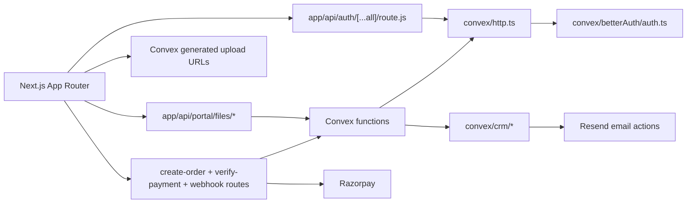

# Citius Travel - Backend Infrastructure

## Architecture overview

The application backend is a Convex-first system with Next.js API routes for browser-facing HTTP edges, Better Auth for identity, Resend for email, and Razorpay for public trip payments. The public site, guest account area, and Citius Connect portal share the same Convex deployment.

## Core stack

| Area | Technology |
| --- | --- |
| Auth runtime | BetterAuth + `@convex-dev/better-auth` |
| Auth proxy in Next.js | `convexBetterAuthNextJs` helpers |
| App database | Convex tables (`userProfiles`, `staffUsers`, `trips`, `bookings`, CRM tables) |
| Citius Connect backend | Convex CRM modules under `convex/crm/` |
| Portal frontend state | `src/components/portal/usePortalWorkspaceState.js` |
| Payments | Razorpay |
| Transactional email | Resend |
| CMS content | Sanity |
| Runtime | Bun, Next.js 16, React 19 |

## Important files

- `convex/auth.config.ts`
- `convex/betterAuth/auth.ts`
- `convex/betterAuth/adapter.ts`
- `convex/lib/authSync.ts`
- `convex/authAccountLinking.ts`
- `convex/http.ts`
- `convex/schema.ts`
- `convex/auth.ts`
- `convex/userProfiles.ts`
- `convex/bookings.ts`
- `convex/crm/lib.ts`
- `convex/crm/staff.ts`
- `convex/crm/queryTeamAssignment.ts`
- `convex/crm/dashboard.ts`
- `convex/crm/activity.ts`
- `convex/crm/notificationSummary.ts`
- `convex/crm/notificationEmails.ts`
- `convex/crm/imports.ts`
- `convex/crm/importActions.ts`
- `convex/crm/savedViews.ts`
- `convex/migrations.ts`
- `src/lib/auth-client.js`
- `src/lib/auth-server.js`
- `src/app/api/create-order/route.js`
- `src/app/api/verify-payment/route.js`
- `src/app/api/webhooks/razorpay/route.js`
- `src/app/api/portal/files/*`

## Data model

### `userProfiles`
- `authUserId`, `email`, `name`, `phoneNumber`, `passportDetailsEncrypted`, `image`
- timestamps: `createdAt`, `updatedAt`
- legacy migration key: `legacyUserId`

### `staffUsers`
- Citius Connect staff identity and role rows, synced by email with Better Auth users.
- Roles drive portal permissions through `convex/crm/lib.ts`.
- Staff rows also store operational profile details used in team pickers, assignment forms, leave routing, and staff workbook sync.

### `trips`
- trip content and pricing (`priceInr`, `priceUsd`)
- capacity (`totalSeats`, `availableSeats`)
- visibility (`isActive`)
- legacy migration key: `legacyTripId`

### `bookings`
- booking linkage (`userId`, `tripId`)
- payment linkage (`razorpayOrderId`, `razorpayPaymentId`, `razorpaySignature`)
- status lifecycle (`pending`, `confirmed`, `failed`, `cancelled`, `refunded`)
- timestamps and migration key (`legacyBookingId`)

### CRM tables
- Sales query, proposal, job-card, traveller, passport, visa, ticketing, operations, hotel/rooming, tour-manager, finance, expense, leave, saved-view, and notification data live in Convex CRM tables.
- Attachments use Convex storage IDs and are served through authenticated same-origin portal file routes instead of browser-visible storage URLs.
- Spreadsheet import flows are batch-oriented and do not cap total row count; parser and validator seams are under `src/lib/portal/spreadsheetImports.js`, `convex/crm/importActions.ts`, and `convex/crm/imports.ts`.

## Auth and session flow

1. Browser calls `/api/auth/*`.
2. Next proxy forwards to Convex BetterAuth handler.
3. BetterAuth persists/session-validates inside Convex component storage.
4. Staff portal access is resolved through Convex staff rows and email-linked auth users.
5. Server-side Next code uses the Better Auth Convex Next helpers from `src/lib/auth-server.js`.
6. Client-side components use `authClient` (`useSession`, `signIn`, `signOut`, `requestPasswordReset`).

Admin-provisioned staff sign in through Forgot password rather than sign-up. Google and email/password accounts are expected to autolink on the same email, and password reset must enable email/password login on Google-only accounts. Auth URL environment variables need full schemes, for example `http://localhost:3000`, and Next.js must be restarted after auth env changes because `src/lib/auth-server.js` reads those values at module load.

## Portal authorization

Portal role definitions and backend guards live in `convex/crm/lib.ts`. The mirrored client constants live in `src/lib/portal/constants.js`, while UI affordance helpers live in `src/lib/portal/permissions.js`.

Important current rules:

- Admin has every permission.
- Directors and Director Cement have all operational permissions except staff management, dropdown/settings management, and activity-log access.
- Any provisioned staff user with at least one role gets leave request, expense view, and expense creation baseline permissions.
- `listDirectory` requires Team Directory access. `listTeamOptions` is the narrower active-staff picker for assignment dropdowns and is guarded by `TEAM_PICKER_PERMISSIONS`.
- Cement base roles are scoped to Cement and Cement Bidding query types; Admin, Directors, and Director Cement are not restricted by cement query-type filtering.

See `docs/PORTAL_ROLES_AND_ACCESS.md` and `docs/PORTAL_PERMISSIONS_ARCHITECTURE.md`.

## Portal CRM surfaces

The portal is routed by `src/components/portal/PortalWorkspace.js`, with shared data/state in `src/components/portal/usePortalWorkspaceState.js`.

Key backend modules:

- `convex/crm/dashboard.ts`: role-aware portal summary and drill-down counts.
- `convex/crm/activity.ts`, `notificationReads.ts`, `notificationSummary.ts`: in-app notification list, explicit read handling, and unread counts.
- `convex/crm/notificationEmails.ts`: Resend-backed email channel for workflow notifications.
- `convex/crm/queryTeamAssignment.ts`: sales/head/director query-team assignment workflow.
- `convex/crm/jobCards.ts`: job-card creation, downstream handoff, collaborator-aware access, travel series/travel batch operations.
- `convex/crm/imports.ts` and `importActions.ts`: spreadsheet preview/commit/export.
- `convex/crm/savedViews.ts`: portal saved views, favorites, pinned sidebar links, and command-palette integration.

See `docs/PORTAL_CRM_WORKFLOWS.md` for the current operational workflow contract.

## Notification channels

Bell notifications and email notifications are separate channels:

- Bell rows target an exact `recipientRole` or `authUserId`.
- Email expansion uses staff email addresses and expands department notifications to the corresponding head role in `expandNotificationEmailRoles`.
- Notification read state should change only when the user clicks a notification, not merely when opening the bell dropdown or Activity panel.

## Payment flow

1. `POST /api/create-order` validates auth + trip via Convex query, creates Razorpay order, then writes pending booking in Convex.
2. `POST /api/verify-payment` verifies Razorpay signature and calls Convex mutation to idempotently confirm booking + decrement seats.
3. `POST /api/webhooks/razorpay` replays status transitions into Convex (`authorized`, `captured`, `failed`, `refunded`).

Payment status mutations still contain a visible TODO for stricter server-only enforcement once Razorpay webhook secrets are fully configured.

## Files and storage

Portal uploads use Convex generated upload URLs. Browser reads go through same-origin Next API routes under `/api/portal/files/...`. Those routes call Convex with the current user's auth context and respond with private no-store headers. Passport payloads are encrypted before durable storage.

## Build and verification

- `bunx convex codegen` regenerates `convex/_generated` and should run after Convex API/schema changes.
- `bunx convex codegen --typecheck enable` is part of the production build path and catches Convex TypeScript errors before Next.js builds.
- `bun test` runs focused backend/frontend tests.
- `bun run lint` runs Biome.
- `bun run check` runs lint plus tests.
- `bun run build` runs Convex codegen with typecheck before `next build`.
- Portal UI changes should use browser verification when visual behavior matters.
- React Doctor is available via `bunx react-doctor@latest --verbose` after portal frontend changes.

`convex/_generated` is gitignored. CI/Vercel should generate it fresh before build.

## Migration tooling

One-time migration scripts live in `scripts/migrations/`:

- `export-postgres-to-json.mjs`
- `import-json-to-convex.mjs`
- `verify-parity.mjs`

Convex import/parity helpers are in `convex/migrations.ts`. Better Auth schema generation is exposed as `bun run auth:schema:generate`.

