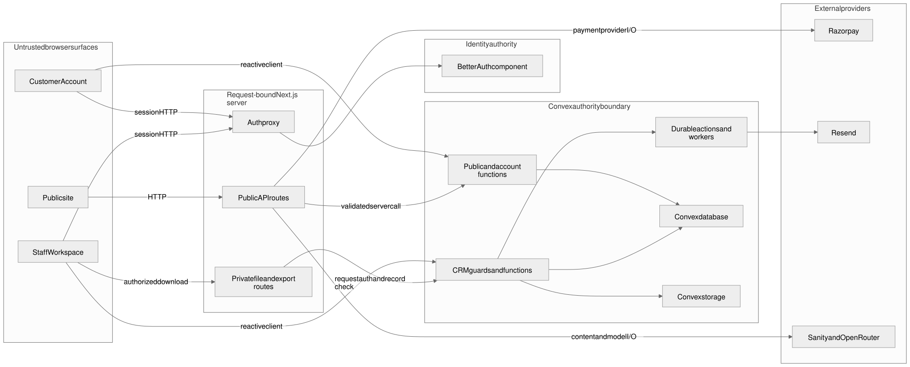

# Citius Travel - Backend Infrastructure

## Architecture overview

The application backend is a Convex-first system with Next.js API routes for browser-facing HTTP edges, Better Auth for identity, Resend for email, and Razorpay for public trip payments. The public site, guest account area, and Citius Connect portal share the same Convex deployment.

The Mermaid
[source](../diagrams/citius-runtime-trust-boundaries.mmd), editable
[Excalidraw scene](../diagrams/citius-runtime-trust-boundaries.excalidraw), and
[PNG render](../diagrams/citius-runtime-trust-boundaries.png) are tracked
together. The diagram separates direct authenticated Convex clients from
request-bound Next HTTP edges and does not assert provider configuration or
Production state.

## Core stack

| Area | Technology |
| --- | --- |
| Auth runtime | BetterAuth + `@convex-dev/better-auth` |
| Auth proxy in Next.js | `convexBetterAuthNextJs` helpers |
| App database | Convex tables (`userProfiles`, `staffUsers`, `trips`, `bookings`, CRM tables) |
| Citius Connect backend | Convex CRM modules under `convex/crm/` |
| Portal frontend state | `src/components/portal/usePortalWorkspaceState.ts` |
| Payments | Razorpay |
| Transactional email | Resend |
| CMS content | Sanity |
| Runtime | Bun, Next.js 16, React 19 |

## Important files

- `convex/auth.config.ts`
- `convex/betterAuth/auth.ts`
- `convex/betterAuth/adapter.ts`
- `convex/lib/authSync.ts`
- `convex/authAccountLinking.ts`
- `convex/http.ts`
- `convex/schema.ts`
- `convex/auth.ts`
- `convex/userProfiles.ts`
- `convex/bookings.ts`
- `convex/crm/lib.ts`
- `convex/crm/staff.ts`
- `convex/crm/queryTeamAssignment.ts`
- `convex/crm/proposals.ts`
- `convex/crm/dashboard.ts`
- `convex/crm/activity.ts`
- `convex/crm/notificationSummary.ts`
- `convex/crm/notificationEmails.ts`
- `convex/crm/imports.ts`
- `convex/crm/importActions.ts`
- `convex/crm/commandReceipts.ts`
- `convex/crm/notificationEmailLedger.ts`
- `convex/crm/passengerExportWorkbook.ts`
- `convex/crm/savedViews.ts`
- `convex/migrations.ts`
- `src/lib/auth-client.js`
- `src/lib/auth-server.js`
- `src/app/api/create-order/route.ts`
- `src/app/api/verify-payment/route.ts`
- `src/app/api/webhooks/razorpay/route.ts`
- `src/app/api/portal/files/*`
- `src/app/api/portal/exports/[operationId]/route.ts`

## Data model

### `userProfiles`
- `authUserId`, `email`, `name`, `phoneNumber`, `passportDetailsEncrypted`, `image`
- timestamps: `createdAt`, `updatedAt`
- legacy migration key: `legacyUserId`

### `staffUsers`
- Citius Connect staff identity and role rows. Staff authorization requires an issuer-qualified
  auth identity resolving to exactly one active `staffUsers` record through an accepted
  `authUserId`. Email matching alone never grants Staff authority.
- Roles drive portal permissions through `convex/crm/lib.ts`.
- Staff rows also store operational profile details used in team pickers, assignment forms, leave routing, and staff workbook sync.

### `trips`
- trip content and pricing (`priceInr`, `priceUsd`)
- capacity (`totalSeats`, `availableSeats`)
- visibility (`isActive`)
- legacy migration key: `legacyTripId`

### `bookings`
- booking linkage (`userId`, `tripId`)
- payment linkage (`razorpayOrderId`, `razorpayPaymentId`, `razorpaySignature`)
- status lifecycle (`pending`, `confirmed`, `failed`, `cancelled`, `refunded`)
- timestamps and migration key (`legacyBookingId`)

### CRM tables
- Sales query, proposal, job-card, traveller, passport, visa, ticketing, operations, hotel/rooming, tour-manager, finance, expense, leave, saved-view, and notification data live in Convex CRM tables.
- Attachments use Convex storage IDs and are served through authenticated same-origin portal file routes instead of browser-visible storage URLs.
- Spreadsheet import flows are batch-oriented and do not cap total row count; parser and validator seams are under `src/lib/portal/spreadsheetImports.ts`, `convex/crm/importActions.ts`, and the stable `convex/crm/imports.ts` registration facade. Focused passenger import, export, and flight owners are documented in [`SPREADSHEET_OPERATIONS.md`](SPREADSHEET_OPERATIONS.md).
- `commandReceipts`, `passengerImportOperations`, and `passengerExportOperations` persist replay
  identity and long-running import/export progress. `notificationEmailDeliveries` stores a
  privacy-safe, monotonic outcome ledger for CRM email sends; `notificationEmailEventSummaries`
  and `notificationEmailSummaryReadiness` provide bounded exact-or-explicitly-partial Activity
  counts.
- `authEmailDeliveries` stores a separate privacy-safe receipt for verification and password-reset
  sends. It contains a one-way correlation digest and safe provider outcome only—never recipient,
  token, URL, or message content. See [`AUTH_EMAIL_DELIVERY.md`](AUTH_EMAIL_DELIVERY.md).

## Auth and session flow

1. Browser calls `/api/auth/*`.
2. Next proxy forwards to Convex BetterAuth handler.
3. BetterAuth persists/session-validates inside Convex component storage.
4. Staff portal access resolves the issuer-qualified auth identity to exactly one active
   `staffUsers` record through an accepted `authUserId`; it never falls back through email.
5. Server-side Next code uses the Better Auth Convex Next helpers from `src/lib/auth-server.js`.
6. Client-side components use `authClient` (`useSession`, `signIn`, `signOut`, `requestPasswordReset`).

Cookie absence is the only anonymous server fast path: when a request contains no recognized
Better Auth cookie, Next skips the same-origin Convex token exchange and current-user query. Any
recognized cookie, including an expired one, still goes through the complete server validation
path. Auth and Portal routes may stream only their generic, identity-free loading shells while that
validation and Portal access resolution run; user, role, permission, and CRM data remain behind the
secure boundary.

Admin-provisioned staff sign in through Forgot password rather than sign-up. Better Auth may
auto-link Google and email/password accounts on the same email, and password reset must enable
email/password login on Google-only accounts. That account linking is not application
authorization: Staff access never falls back through email. The canonical identity and migration
boundary are owned by [`docs/adr/0009-auth-token-identity-migration.md`](adr/0009-auth-token-identity-migration.md)
and `convex/crm/lib/staffAccess.ts`. Auth URL environment variables need full schemes, for example
`http://localhost:3000`, and Next.js must be restarted after auth env changes because
`src/lib/auth-server.js` reads those values at module load.

Verification and reset callbacks use bounded provider retry with stable idempotency and write a
dedicated privacy-safe receipt. Internal onboarding treats only a matching `sent` receipt as
delivery evidence; Better Auth's generic reset response is deliberately not interpreted as sent.

## Portal authorization

Portal role definitions live in `convex/crm/lib/rolePolicy.ts`; backend guards
consume them through `convex/crm/lib.ts`. The mirrored client constants live in
`src/lib/portal/constants.js`, while UI affordance helpers live in
`src/lib/portal/permissions.js`.

Important current rules:

- Admin has every permission.
- Directors receive every portal permission. Director Cement has all
  permissions except staff management, dropdown/settings management, and
  activity-log access.
- Any provisioned staff user with at least one role gets leave request, expense view, and expense creation baseline permissions.
- `listDirectory` requires Team Directory access. `listTeamOptions` is the narrower active-staff picker for assignment dropdowns and is guarded by `TEAM_PICKER_PERMISSIONS`.
- Cement base roles are scoped to Cement and Cement Bidding query types; Admin, Directors, and Director Cement are not restricted by cement query-type filtering.

See `docs/PORTAL_ROLES_AND_ACCESS.md` and `docs/PORTAL_PERMISSIONS_ARCHITECTURE.md`.

## Portal CRM surfaces

The portal is routed by `src/components/portal/PortalWorkspace.tsx`, with shared data/state in
`src/components/portal/usePortalWorkspaceState.ts`.

Key backend modules:

- `convex/crm/dashboard.ts`: role-aware portal summary and drill-down counts.
- `convex/crm/activity.ts`, `notificationReads.ts`, `notificationSummary.ts`: in-app notification list, explicit read handling, and unread counts.
- `convex/crm/notificationEmails.ts`: Resend-backed email channel for workflow notifications.
- `convex/crm/queryTeamAssignment.ts`: sales/head/director query-team assignment workflow.
- `convex/crm/jobCards.ts`: job-card creation, downstream handoff, collaborator-aware access, travel series/travel batch operations.
- `convex/crm/imports.ts` and `importActions.ts`: spreadsheet preview/commit/export.
- `convex/crm/commandReceipts.ts`: actor-scoped command IDs and canonical payload digests for
  replay-safe writes.
- `convex/crm/commercialFiles.ts`: source/team-authorized file lifecycle plus the bounded,
  continuation-fenced 14-day retention purge described in
  [`COMMERCIAL_FILE_RETENTION.md`](COMMERCIAL_FILE_RETENTION.md).
- `convex/crm/notificationEmailLedger.ts`: monotonic delivery outcomes, transactional event
  projections, two-pass readiness reconciliation, and permissioned summaries.
- `convex/crm/savedViews.ts`: portal saved views, favorites, pinned sidebar links, and command-palette integration.

See `docs/PORTAL_CRM_WORKFLOWS.md` for the current operational workflow contract.

## Notification channels

Bell notifications and email notifications are separate channels:

- `publishWorkflowNotification` requires an explicit target plan for both channels.
- Bell rows target an exact `recipientRole`, `recipientStaffId`, or `authUserId`.
- Role email expansion uses portal roles plus additive additional alert roles and expands department
  notifications to the corresponding head role in `expandNotificationEmailRoles`; direct staff
  email targets resolve only the selected active staff records.
- `{ kind: "none" }` suppresses email for a workflow event without changing its bell rows.
- Notification read state should change only when the user clicks a notification, not merely when opening the bell dropdown or Activity panel.
- The always-mounted shell uses one `notificationBellState` subscription. Its eight visible rows
  resolve receipts through per-notification composite indexes; Activity's larger history remains
  route-gated.
- `notificationTargetCounts` stores total bell rows by exact role/staff/user target, while
  `notificationReadTargetCounts` stores per-staff or per-auth read totals for those targets. Current
  roles are summed at read time, direct+role rows have one composite target key, and staff-targeted
  rows remain stable across auth relink.
- Until `notificationUnreadProjectionReadiness` completes the notification, receipt, and two
  verification scans, the shell returns `coverage: partial` from a bounded legacy fallback. It
  returns `coverage: complete` only when the current projection version has zero marker residuals.

The `convex/crm/notificationUnreadProjectionMigration.ts` `startReconciliation` function is the
internal bounded backfill entrypoint. It processes 50 rows per scheduled mutation and converts legacy direct `readAt` state to
staff/user receipts before verification. An active or complete current generation is idempotent;
stale or failed generations can restart. Starting it and measuring the resulting shell query are
target-bound operations and require an explicitly identified non-production deployment first.

## Payment flow

1. `POST /api/create-order` validates auth + trip via Convex query, creates Razorpay order, then writes pending booking in Convex.
2. `POST /api/verify-payment` verifies Razorpay signature and calls Convex mutation to idempotently confirm booking + decrement seats.
3. `POST /api/webhooks/razorpay` replays status transitions into Convex (`authorized`, `captured`, `failed`, `refunded`).

All four public payment-status mutations call
`assertPaymentMutationSecret(args.serverSecret)` before changing booking state.
Next payment routes and the Razorpay webhook obtain that server capability from
`PAYMENT_MUTATION_SECRET` and fail closed when it is missing or invalid. See
[`BOOKING_PAYMENT_TRANSITIONS.md`](BOOKING_PAYMENT_TRANSITIONS.md) and
`convex/bookingsPaymentSecurity.test.ts`.

## Files and storage

Portal uploads use Convex generated upload URLs. Browser reads go through same-origin Next API routes under `/api/portal/files/...`. Those routes call Convex with the current user's auth context and respond with private no-store headers. Passport payloads are encrypted before durable storage.

## Build and verification

- `bunx convex codegen` regenerates `convex/_generated` and should run after Convex API/schema changes.
- `bunx convex codegen --typecheck enable` is part of the production build path and catches Convex TypeScript errors before Next.js builds.
- `bun run test -- <path...>` runs focused backend/frontend tests through the
  repository's isolated test configuration.
- `bun run lint` runs the raw Ultracite/Biome and anti-slop checks.
- `bun run lint:all` is the canonical lint gate: Ultracite must report zero errors and zero
  warnings, then anti-slop, the checked-in zero-diagnostic baseline, and Studio ESLint must pass.
- `bun run check` runs `lint:all`, the high-risk coverage contract, and Convex integration tests.
- `bun run performance:check` validates public asset budgets and the authenticated Staff Workspace
  performance baseline, including source-hash freshness.
- `bun run verify:local` runs the required target-neutral lint, typecheck, test, and coverage gate.
- Performance, assets, configuration, dependency audits, and Studio builds are separate checks run
  when the changed surface or release task requires them.
- `bun run build` runs Convex codegen with typecheck before `next build`.
- Portal UI changes should use browser verification when visual behavior matters.
- React Doctor is available through the repository-pinned `bun run doctor -- --verbose --scope changed --include-untracked --no-score` after portal frontend changes.

The five reviewed Convex API modules (`api.d.ts`, `api.js`, `dataModel.d.ts`, `server.d.ts`, and
`server.js`) are tracked under `convex/_generated` so credential-free tests work from a clean clone.
Every other file in that directory remains ignored and is rejected by diff hygiene. Target-bound
builds still run fresh Convex codegen before Next.js compiles.
See [`VERIFICATION.md`](VERIFICATION.md) for the distinction between focused,
target-neutral, deployment, and authenticated-production evidence.

## Migration tooling

Reviewed Convex migration and parity helpers live in `convex/migrations.ts` and focused migration
modules such as `convex/sacredBharatGroupMembershipMigration.ts`.
Sacred Bharat global ranks use the mounted `@convex-dev/aggregate` component and remain behind the
independently verified cutover in `docs/migrations/sacred-bharat-leaderboard-ranks.md`.
Active migration runbooks live under `docs/migrations/`, and Better Auth schema
generation is exposed as `bun run auth:schema:generate`. The earlier local
Postgres export/import scripts are no longer in this checkout; do not follow
stale references to a root migration-script directory.
