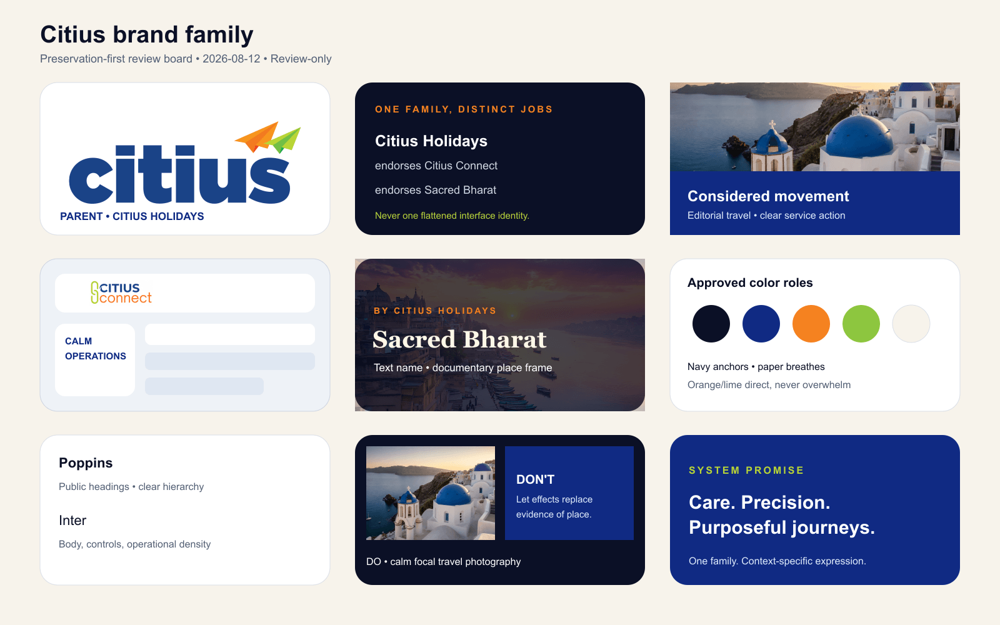

# Citius public visual-world board

This board translates the brand architecture into a practical review reference for public marketing
work. It names the mood and composition to seek without copying external sites, image assets, or
their distinctive layouts.

## Citius Holidays — considered movement

**Mood:** assured, worldly, warm, and quietly premium. The traveller should feel looked after by an
experienced team rather than sold a template.

**Visual ingredients:** full-bleed destination photography with a calm focal point; navy or deep
blue anchoring surfaces; warm paper/cream sections; a small amount of orange or lime for direction;
editorial headings with comfortable line length; clear, generous primary actions.

**Avoid:** generic “travel deals” collage, noisy gradients over every section, stock-photo smiles as
the only story, and decorative UI that competes with the destination.

## Citius Connect — calm operations

**Mood:** capable, legible, and fast under pressure. The visual system should reduce the cost of
finding the next action for staff who spend hours in the CRM.

**Visual ingredients:** compact but comfortable data tables, role-aware navigation, explicit status
hierarchy, restrained motion, strong focus rings, and warm-neutral surfaces that keep long sessions
readable.

**Avoid:** marketing hero treatment inside the CRM, low-contrast glass panels over data, or a
public-site redesign that makes workflows slower.

## Sacred Bharat — contemplative discovery

**Mood:** reverent, curious, and grounded in place. The experience can feel more spacious and
reflective than Citius Connect while remaining an endorsed Citius Holidays product.

**Visual ingredients:** dark navy, cream, saffron/gold accents, documentary temple/place imagery,
measured serif display moments, clear progress affordances, and respectful local context.

**Avoid:** exoticising people or traditions, turning sacred places into collectible “loot,” or
using spiritual language as a guarantee of personal transformation.

## Composition rules for public marketing

1. Give each section one dominant idea and one obvious next action.
2. Use imagery as evidence of place and experience; provide useful alt text and avoid text baked into
   images.
3. Prefer a strong surface contrast and one accent over layered translucent cards and decorative
   blur.
4. Keep pill-shaped controls for short statuses or compact navigation; primary CTAs may be rounded,
   but must still read as actions at a glance.
5. Use the bounded OKLCH roles and media edge tokens documented in
   [`docs/PUBLIC_VISUAL_IDENTITY.md`](PUBLIC_VISUAL_IDENTITY.md).

## Review status

**Review-only.** Approved as a **baseline board for public marketing review**. It is not an asset
library, a runtime design-system authority, or authorization for a broad redesign. New work should
link the relevant section and record any intentional exception in its implementation ticket.

## Source and provenance

The rendered board and social cards use only repository-owned imagery already shipped by this site:
the current Citius Holidays WebP mark, the approved Citius Connect raster, the Santorini gallery
photograph, and the Varanasi spiritual-gallery photograph. The composition is generated
deterministically by [`scripts/generate-public-brand-assets.ts`](../scripts/generate-public-brand-assets.ts).
It does not grant new licensing rights or approve new logo variants. Sacred Bharat remains a text
name endorsed by Citius Holidays; no unapproved Sacred Bharat symbol has been invented.

## Rendered overview board text alternative

The review board is a three-by-three family overview. Its first row shows the current Citius
Holidays mark, explains that Citius Holidays endorses the distinct Citius Connect and Sacred Bharat
jobs, and pairs calm destination photography with direct service action. The second row presents a
restrained operational Citius Connect frame, a text-only Sacred Bharat treatment over documentary
Varanasi photography, and the approved navy, blue, orange, lime, and paper color roles. The final row
assigns Poppins to public headings and Inter to body and operational copy, contrasts evidence-led
travel photography with effect-led decoration, and closes with the shared promise: care, precision,
and purposeful journeys through context-specific expression.
