# Notification email delivery

CRM notification email is queued from the same transaction that creates its in-app notification
rows. `publishWorkflowNotification` requires separate, explicit bell and email targets. The first
inserted notification ID is the stable event identity passed to the scheduled action. Bell rows
target exact roles, users, or staff IDs; role email targets use portal roles plus additive
**Additional email alert roles**, while direct staff targets resolve only the selected staff IDs.



The editable source is `diagrams/notification-delivery-replay.mmd`; the rendered SVG/PNG and
Excalidraw scene are kept beside it.

## Idempotency

Each provider request uses an idempotency key shaped as:

```text
crm-notification/<notification-id>/<recipient-sha256-prefix>
```

The recipient is normalized and hashed before it enters the key. Titles, bodies, record details, email addresses, and secrets are not included. Every retry for a recipient—including 429, provider 5xx, ambiguous network failure, or scheduled-action replay—reuses the same key. Different recipients for the same event receive distinct keys. Sequential recipient staggering and retry backoff remain in place.

Resend currently retains idempotency keys for a provider-defined window. Scheduler replays must therefore preserve the original event ID and must never replace it with a retry timestamp.

## Delivery ledger

Each recipient outcome is recorded in `notificationEmailDeliveries` with one of these monotonic
statuses: `queued`, `sending`, `retrying`, `sent`, `skipped`, or `exhausted`. A later scheduler replay
cannot move a `sent` row back to `queued` or `sending`, and ledger writes retry with bounded
backoff if the recording mutation is temporarily unavailable. Reusing one idempotency key with a
different event ID fails closed rather than moving or double-counting the recipient.

Every accepted insert or status transition updates `notificationEmailEventSummaries` in the same
transaction and records the projected event/status marker on the delivery row. The Activity query
reads this bounded projection instead of truncating recipient rows. It returns `coverage: complete`
only after `notificationEmailSummaryReadiness` records a successful backfill and independent
verification pass for the current projection version. Before that point—including an interrupted or
failed reconciliation—it returns `coverage: partial`, and Activity labels the counts as partial.

`startDeliverySummaryReconciliation` schedules 50-row pages. The backfill adds only unprojected or
stale transitions, so restart and replay are idempotent. A second full scan must find zero residual
markers before readiness becomes complete. Active/current runs do not schedule a competing
generation; a stale or failed generation may be restarted. This entrypoint is target-bound: invoke
and verify it separately on each approved non-production deployment before any production rollout.

The Activity delivery summary is guarded by `view:emailDeliveryStatus` and returns grouped counts
only when the caller can receive the originating bell notification. It never returns raw recipient
addresses, recipient hashes, message content, provider status, or provider response bodies.
Department heads, Admin, Directors, and Director Cement receive this oversight permission; ordinary
department roles do not.

## Environment transition

`RESEND_API_KEY` is canonical in both Next.js and Convex environments.

`RESEND_KEY` is a temporary legacy fallback for Convex notifications and the legacy Next.js contact
email endpoint through **30 September 2026**. The consented Website enquiry form queues its Sales
and `info@citius.in` delivery through Convex notification delivery. When the fallback is used, the
action logs only the legacy variable name and migration deadline; it never logs the value. Remove
the fallback after every environment has been checked and migrated.

Operator checklist:

1. Set `RESEND_API_KEY` in the Convex deployment environment.
2. Trigger one non-production CRM notification and confirm delivery.
3. Remove `RESEND_KEY` from that environment.
4. Repeat for preview and production before the sunset date.
5. Remove the fallback constants and tests after the migration is complete.
