# Portal CRM workflows

This doc records the current Citius Connect behavior implemented across recent portal and Convex commits. It is intentionally operational: the role matrix explains who can access things, and this file explains how the main workflows move.

## Main source files

| Workflow area | Primary files |
| --- | --- |
| Portal routing and list views | `src/components/portal/PortalWorkspace.tsx` |
| Shared portal state and Convex hooks | `src/components/portal/usePortalWorkspaceState.ts` |
| Bounded route data and navigation measurements | `src/components/portal/workspace/usePortalWorkspaceData.ts`, `src/lib/portal/navigationPerformance.ts` |
| Shared lists, actions, and pagination | `src/components/portal/SelectableDataTable.tsx`, `src/components/portal/PortalActionMenu.tsx`, `src/components/portal/QueryRowActions.tsx` |
| Modal form lifecycle and submit routing | `src/lib/portal/modalLifecycle.js`, `src/lib/portal/modalCommandExecutor.ts` |
| Query team assignment | `convex/crm/queryTeamAssignment.ts`, `src/lib/portal/permissions.js` |
| Sales Decision and Confirmed Offer | `convex/crm/queryCommands.ts`, `convex/crm/queryStatusPolicy.ts`, `convex/crm/confirmedOffer.ts` |
| Replay-safe command receipts | `convex/crm/commandReceipts.ts`, `src/components/portal/workspace/usePortalWorkspaceMutations.ts` |
| Job cards and downstream operations | `convex/crm/jobCards.ts`, `src/components/portal/jobCard/JobCardCommandCenter.js` |
| Spreadsheet import/export | `src/lib/portal/spreadsheetImports.ts`, `src/lib/portal/spreadsheetExports.ts`, `convex/crm/imports.ts`, `convex/crm/importActions.ts` |
| Notifications | `convex/crm/activity.ts`, `convex/crm/notificationReads.ts`, `convex/crm/notificationSummary.ts`, `convex/crm/notificationEmails.ts`, `convex/crm/notificationEmailDetails.ts` |
| Notification delivery ledger | `convex/crm/notificationEmailLedger.ts` |
| Leave | `convex/crm/leave.ts`, `convex/crm/leaveApprovers.ts`, `convex/crm/leavePolicy.ts`, `convex/crm/leaveLapse.ts` |
| Expenses and finance | `convex/crm/finance.ts`, `convex/crm/expenseAttachments.ts`, `convex/crm/expenseAttachmentActions.ts` |
| Saved views and command palette | `convex/crm/savedViews.ts`, `src/lib/portal/savedViews.js`, `src/components/portal/PortalCommandPalette.js`, `src/components/portal/PortalShell.tsx` |
| Portal chrome and stacking | `src/lib/portal/zIndex.ts` |

## Consented inbound enquiries

The public Contact form, Citius Concierge contact handoff, and Sacred Bharat planning handoff all
enter one durable `inboundQueryIntents` queue. Website submissions require affirmative contact
consent and use a stable browser idempotency key. The public surface reports success only after the
server-only gateway has committed the intent; a retry of the same key reuses that intent and does
not create another Sales alert.

Sacred Bharat offers this handoff only from an explicit Trail action or after the Journey Planner
reaches its completed state. Its bounded context stores one canonical trail slug or temple ID;
contact fields, dates, pax, source, and consent may cross the boundary, but AI output, Soul Score,
darshan history, wishlist contents, passport data, and hidden local state may not. Sales sees the
catalog-derived planning label. Conversion preserves `Sacred Bharat`, the consent timestamp, and
the inbound-intent link on the Query; confirmation carries the same attribution into the immutable
Confirmed Offer.

Sales, Sales Head, Admin, and Director roles can filter and open inbound leads. They can complete a
pending lead in exactly one of two ways:

- Convert it to a Query, retaining the inbound intent ID, source, consent timestamp, accountable
  staff member, and conversion time.
- Dismiss it with one bounded reason: Not qualified, Duplicate enquiry, or Unable to reach. The
  consent and provenance row remains available.

Both terminal commands are replay-safe for the same outcome and reject a conflicting outcome.
Legacy terminal rows keep an unknown outcome date rather than receiving an invented timestamp.
Website enquiries send the normal Sales bell/email notification and queue the retained
`info@citius.in` mailbox copy from the same durable workflow. Provider outcomes remain visible in
the notification delivery ledger without exposing customer contact data in aggregate status reads.

## Query lifecycle

Sales creates and manages enquiries from All Sales Queries. The query lead stage for a lost enquiry is `Lost`, not `Closed`.

Sales-facing decisions use Sales Decision values:

- `Under Discussion`
- `Date/Destination Change Required`
- `Order Confirmed`
- `Order Lost`

Order Lost and lost reason are sales-only. Contracting users should not see or drive that sales-only lost flow through their contracting status dropdown.

Sales Decision and Contracting Progress are separate server commands. Contracting Progress accepts
only `Query Received`, `Proposal in progress`, or `Proposal sent`; it cannot confirm or lose an
order. Sales Decision derives the matching lead/contracting projections on the server and rejects
mixed or decision-incompatible fields before any write or notification. `Order Confirmed` and
`Order Lost` are terminal. A confirmed Query clears lost-reason fields, and a lost Query cannot have
a Confirmed Offer.

Approx. margin stays empty until Order Confirmed and is entered manually by Sales. It must not be auto-calculated from budget or contracting costs.

Contracting owner labels in portal UI read Contracting SPOC. The database fields remain `contractingOwnerId` and `contractingOwnerName`.

## Replay-safe commands

Durable side-effect commands receive a UUID command ID. Convex stores the actor, operation, target,
and canonical payload digest in a receipt. Repeating the same command returns the original result;
reusing the command ID with a different target or payload is rejected. The current UUID-guarded
flows are proposal handoff to Sales, exact-revision Order Confirmed, and passenger export. Passenger import
batches use a source digest and stable batch IDs under their durable operation manifest.

## Query team assignment

Sales, Sales Head, and Sales Cement can do the initial Sales assignment when they have `manage:queries`. That initial form requires a Contracting SPOC and Ticketing Scope, and it cannot assign ticketing SPOCs or reassign existing teams.

Head/director assignment can assign or reassign contracting and ticketing:

- Contracting assignment: Admin, Directors, Director Cement, Contracting Head, Operations Head.
- Ticketing assignment: Admin, Directors, Director Cement, Head of Ticketing.

Assignable contracting staff include `Contracting`, `Contracting Head`, and `Contracting Cement`. Assignable ticketing staff include `Ticketing` and `Head of Ticketing`.

Assignments patch the query, mirror owner fields onto linked job cards, create assignment activity, notify assigned staff, and notify relevant heads. If ticketing is assigned or ticketing scope is not `Not required`, Head of Ticketing is included in head notifications.

Email and bell delivery intentionally differ for query-team assignment:

- Email goes only to the selected Contracting and Ticketing SPOCs through direct staff targeting.
- Relevant heads can still receive oversight bell rows.
- When Sales submits a ticketing-scoped query without a Ticketing SPOC, Head of Ticketing also gets
  the actionable assignment email. Other head-role oversight rows use an explicit `emailTargets:
  { kind: "none" }` plan.

## Proposals and sales handoff

Contracting sends costing to Sales through Send to Sales. The query shows as With Sales, Sales receives an in-app notification, and Sales uses Sales Decision for confirm, revision, or lost.

Send to Sales targets exactly one `{ proposalId, queryId, proposalRevision }` pair. It stores an
immutable handoff snapshot before the command receipt. Sales can confirm only the current revision
handed to that Query; editable browser prices and a newer unhanded Proposal revision are rejected.
The retired `proposals.markAccepted` and generic `queries.updateStatus` capabilities fail closed.

Proposal cost price is per person and auto-calculated from land, airfare, and visa cost per pax. Contracting enters `visaCostPerPax`; manual CP entry is not part of the workflow. Tax supports 5%, 18%, or a custom rate.

Proposal Pricing Complete means ready for Proposal Handoff to Sales only. It does not authorize client delivery or Job Card creation; Sales must record Order Confirmed before Accounts can open a Job Card.

Proposal Doc is separate from the sales proposal handoff action. Query rows keep Reference Itinerary editable; Proposal Doc actions are view/download-only from the linked proposal. The `finalizedPdf` storage/API name remains only for compatibility.

## Job-card creation

Order Confirmed alerts Accounts plus the assigned contracting, operations, and ticketing teams. Any Accounts team member can create a job card for a confirmed query, and Accounts Head/Admin/Directors/Director Cement can manage the job-card creator allowlist.

The Confirmed Offer copies commercial amounts only from the exact immutable Proposal-Query handoff
and records the same confirmation clock as the Query. The Accounts modal loads focused Query detail,
locks the selected Proposal and commercial fields, and refuses Save while the offer is loading or
missing. It hydrates each selected Query once, so a late reactive update does not overwrite an
Accounts user's pax or date edits. Dashboard age for “needs Job Card creation” uses `confirmedAt`;
missing confirmation time stays unknown rather than falling back to a later `updatedAt`.

Job card numbers append the linked Assigned Sales Rep's initials after the
sequence number, for example `JC-0001-NS`; they do not use the Accounts creator
or approver.

After Accounts opens a job card, downstream teams are notified to start traveller master, ticketing, passport, visa, hotel/rooming, tour manager, and finance work.

The editable source is `diagrams/crm-query-to-job-card.mmd`; the Excalidraw, SVG, and PNG renders
are kept beside it.

## Legacy lead-stage migration

`Closed` remains accepted by storage only during the widening window. Public writer validators
accept `Lost` and reject `Closed`; public reads normalize a legacy `Closed` row to `Lost`.
`convex/crm/closedLeadStageMigration.ts` provides a bounded dry run, an apply pass with a
server-owned registry cursor, an independent verifier, and a zero-residual status query. It touches
only the Query `leadStage` field, never Job Card statuses. See
`docs/migrations/query-lead-stage-closed-to-lost.md`; no target run is implied by source completion.

## Travel series and travel batches

The portal UI labels the query option as Travel in Series. Backend fields, table names, and spreadsheet columns still use travel batch terminology.

A job card can have multiple travel batches. A travel batch can scope travellers, flight groups, and tour manager assignment. Tour manager calling board rows must filter by the traveller's batch when a job card is split.

Import behavior:

- A present Travel Batch column maps rows to that batch.
- An absent Travel Batch column preserves an existing traveller batch.
- A blank Travel Batch value clears the traveller batch.
- Modal unbatch sends `travelBatchId: ""`, not `undefined`.

## Traveller and passenger data

Traveller master and aligned lists filter by Job Card. They are not unscoped all-passenger views.

Traveller master includes gender (`Male` or `Female`) and passport expiry. Passport expiry display should use the same resolved date as exports, with critical/warning countdowns when expiry blocks or nears blocking travel relative to job start.

Linked-entity selects in portal forms should autofill dependent fields such as job card, traveller, PNR, query, visa, and related records.

## Spreadsheet imports and exports

Spreadsheet flows run through parser -> portal row mapper -> Convex validators -> import processor. Total row count is not capped. Passenger commit work is batched internally, but the user-facing upload can cover the whole workbook.

The client sends passenger preview and commit work in 50-row requests. The Convex operation record
tracks completed batches, created/updated/failed rows, retryable versus terminal errors, remaining
work, and room summaries. The browser source digest is only an operation reattachment hint. Before
row writes, Convex computes the prepared-content batch identity and claims the declared operation
position; a different payload cannot reuse that position. Each prepared row commits through its own
transaction, so a later Visa, Passport, PNR, Vendor, Ticket, or metric-scheduling failure rolls the
whole row back. A partial operation remains visible until all retryable work completes.

Passenger import/export supports:

- Travel Batch
- gender
- passport expiry
- per-job-card room summary on preview/commit

Traveller master, rooming, passport, visa, and ticketing templates include Travel Batch and gender where relevant.

Room type labels are canonicalized as Single, Twin, Double, Triple, Child with Bed, and Family Room. Legacy `SGL`, `DBL`, and `TPL` values map into the canonical labels.

Flight import/export uses a flight itinerary workbook grouped by job card and optional Travel Batch. `commitFlightImport` upserts flight groups and segments using import keys so repeated imports update existing rows instead of blindly duplicating them.

Passenger-family exports run as durable operations. The UI shows running, completed, failed, or
expired state and requests the private download only after the operation is complete.

The maintained operation-state, retry, permission, download, expiry, and cleanup reference is
[`SPREADSHEET_OPERATIONS.md`](SPREADSHEET_OPERATIONS.md). It includes separate editable import and
export diagrams and the safe next action for every visible state.

## Dashboard and list views

Portal dashboard summary data comes from `convex/crm/dashboard.ts` `getPortalSummary`. The dashboard uses role-aware persona slices, actionable KPI groups, drill-down links, and the shared period control.

List views use one sticky `PortalListToolbar` with compact titles, search, filters, date range, save-view actions, and filtered result counts. Saved views live in sidebar Pinned and the command palette, not as a persistent chip row.

The primary action for the current workflow remains visible. Secondary actions use an anchored
**More** dropdown, not a modal. Query rows keep Sales Decision or the relevant workflow action
visible; Edit query, Reference Itinerary, Assign teams, and Delete live under More. Traveller,
Ticketing, Flights, Hotel/Rooming, Passport, and Visa keep their create action visible and place
secondary import/export actions under the toolbar More menu.

Shared data tables show 25 loaded rows per page. Selection can span pages; the visible select-all
control applies only to the current page. Replacing rows after filters or search returns to page 1,
while appending another server cursor page preserves the current page. When more authorized server
records exist, the list exposes a separate **Load more records** action.

Queries, Proposals, and Job Cards also record a privacy-safe navigation snapshot. The release gate
checks cold and warm route-ready time, first content time, payload bytes, resource transfer bytes,
logical subscriptions, and duplicate subscriptions. See
[`STAFF_WORKSPACE_PERFORMANCE.md`](STAFF_WORKSPACE_PERFORMANCE.md) for the budgets and evidence
command.

Date ranges are stored as ISO values and displayed as DD/MM/YYYY. Inverted From/To ranges must error and skip filtering; they should not silently swap.

The Pipeline page is available when the user can manage queries or view contracting.

## Notifications

Bell notifications and email notifications are separate. Every workflow calls
`publishWorkflowNotification` with explicit `bellTargets` and `emailTargets`. Bell rows target exact
roles, staff IDs, or auth users; a role email target resolves both the staff member's portal roles
and additive **Additional email alert roles**, then expands base department roles to their head role.
An explicit `{ kind: "none" }` email target suppresses email without removing bell delivery.

CRM email delivery writes a privacy-safe ledger with monotonic `queued`, `sending`, `retrying`,
`sent`, `skipped`, and `exhausted` states. Delivery summaries are restricted to the
`view:emailDeliveryStatus` permission (department heads, Admin, Directors, and Director Cement),
and expose counts plus permitted notification links without recipient addresses or provider
response bodies. Scheduler or provider retries cannot move a sent row backwards.

Unread state changes only when a user clicks a notification. Opening the bell dropdown or Activity panel must not mark rows read.

Notification deep links use `?open=` and `?id=`. Email detail rendering is centralized in `convex/crm/notificationEmailDetails.ts` so entity-specific emails can include useful context for queries, job cards, flights, expenses, leave, and tour manager assignments.

## Leave

Leave approvals are two-stage:

1. The designated leave head approver approves first.
2. HR/final authority approves second.

One approval must never complete both stages. HR does not approve the head stage unless HR is the assigned head approver or an Admin/Director override is being used.

Leave head approver defaults come from staff profile or leave matrix data, with a manual staff override still available. The Settings allowlist hides Sync leave approvers from matrix, but the matrix-backed column and manual override remain part of the model.

Unused Casual/Sick leave lapses automatically on 31 March IST through `convex/crons.ts` -> `convex/crm/leaveLapse.ts`. The operation pages a fixed active-staff cutoff and reports queued/running/completed/failed state with processed/lapsed counts. An authorized manual start must supply the explicit consecutive fiscal year (for example, `2025-2026`); it never falls back to a historical year. Replays and overlapping automatic/manual starts reuse the current fiscal-year run.

## Expenses and files

Every staff user with a portal role can view and create expenses. Tour Managers can manage their own expenses. Finance can approve expenses.

Expense files use Convex storage and authenticated same-origin portal file routes. The same pattern applies to query/proposal files and Proposal Docs. Browser-visible Convex storage URLs should not be exposed for portal documents.

Expense form labels should use Category with the `Select category...` placeholder. Do not reintroduce Expense Head terminology in portal forms.

## Portal chrome

Portal z-index values are centralized in `src/lib/portal/zIndex.ts`.

The header renders the signed-in Google profile image when available and falls back to the user
icon. The shell uses the existing `/gallery/bgfooter.webp` texture at low opacity so light pages
retain the established Citius visual language. Finance, Ticketing, dashboard, and other metric
cards use fluid grids rather than fixed-width legacy cards, and entity forms share the sectioned
hierarchy introduced by the Sales Query form.

Current ordering principles:

- Sticky list toolbar stays below header chrome.
- Bell and notification dropdowns sit above toolbar blur.
- Command palette blurs main content only, not the sidebar.
- Toasts sit above modals so validation feedback stays visible.
- Confirm dialogs stay above toasts.

The command palette result list scrolls and skips open/close animation. Sidebar shortcut submenus must stay closable even on the active route, and the sidebar must scroll when nav is expanded so the mod-key footer hint never overlaps open menus.
