# Spreadsheet operations

This guide is the maintained reference, explanation, and operator how-to for Citius Connect passenger-family imports and exports. It covers passenger, Traveller Master, rooming, passport, and visa workbooks; flight workbooks keep their separate Job Card and Travel Batch flow.

## Reference

### Permissions

Convex authorizes every requested kind and fails closed for empty or unknown kind sets. Import requires the complete manage alternative; export requires the corresponding view alternative.

| Kind | Import permission alternative | Export permission alternative |
| --- | --- | --- |
| Passenger | Manage Ticketing, or both Manage Travellers and Manage Visa | View Ticketing, or both View Travellers and View Visa |
| Traveller Master | Manage Travellers and Manage Visa | View Travellers and View Visa |
| Rooming | Manage Operations | View Operations |
| Passport | Manage Visa | View Visa |
| Visa | Manage Visa | View Visa |

Authorization is also scoped to the selected Job Card. A displayed button is not authority; each source read, operation query, and download rechecks the current actor.

### Import identity and states

The browser parses and maps the workbook, then sends 50-row requests. There is no total workbook row cap. At most three batch requests run concurrently, and every prepared row commits in its own Convex transaction.

An import has two related identities:

- The stable source digest lets the same actor reattach to the durable operation for the same Job Card and manifest.
- Convex derives each batch receipt from the Job Card, server-owned batch position, and prepared content. Randomized encrypted payload bytes are excluded from this identity, while corrected protected content changes it.

The durable operation records total, processed, remaining, created, updated, failed, room summary, terminal batch count, and status:

- `running`: at least one declared batch position has not reached a terminal outcome.
- `completed`: every position is terminal and no row remains or failed.
- `partial`: every position is terminal, but one or more rows failed or remain unresolved.

Batch failures are classified separately:

- Retryable failures are temporary infrastructure outcomes such as timeouts, rate limits, unavailable services, or conflicts. Retry the same operation and batch identity.
- Terminal failures are invalid or unrecoverable row outcomes. Correct the source content; do not manufacture a new identity merely to bypass the receipt.

Each row is atomic. A later Visa, Passport, PNR, Vendor, Ticket, or metric-scheduling failure rolls back that row instead of leaving partial dependent data.



Editable sources: [Mermaid](../diagrams/passenger-import-operation.mmd) and [Excalidraw scene](../diagrams/passenger-import-operation.excalidraw).

### Export identity and states

Starting an export requires a UUID command ID. The current actor, kind, Job Card, and command identify one durable operation. A running operation owns a short lease; a failed operation or stale lease can be taken over with the same command and resumes from the persisted source cursor.

The scheduled worker processes four source pages per invocation. Each page reads up to 100 Travellers, bounds ticket relations to 64 per Traveller, sorts the page, and writes a private source chunk with 256 KiB per-row and 4 MiB per-chunk limits. The operation persists the next cursor, page index, row count, Job Card code, and completion flag before another worker continues.

Finalization performs a bounded 16-way external merge and streams the selected Excel template to a temporary file. The representative 20,000-row fixture is measured against a 128 MiB worker RSS-growth budget. This preserves all five layouts and their stable ordering without collecting the full workbook in browser or action memory.

Export states are:

- `running`: source pages or finalization are in progress. The dialog may be closed; recent-operation state remains visible.
- `completed`: the final workbook is ready for its initiator while the artifact has not expired.
- `failed`: processing stopped. Retrying the same command resumes durable source progress.
- `expired`: the download and partial source artifacts are no longer available; generate a new export.

Completed workbooks expire after 15 minutes. The browser receives a same-origin `/api/portal/exports/[operationId]` route rather than a storage URL. That route requires a current session, reauthorizes initiator, kind, and Job Card access, disables caching, rejects redirects, and streams the private artifact. Completion and expiry schedule bounded, reference-safe cleanup for both final and partial storage objects.



Editable sources: [Mermaid](../diagrams/passenger-export-operation.mmd) and [Excalidraw scene](../diagrams/passenger-export-operation.excalidraw).

### Source ownership

The public Convex registration facade stays in `convex/crm/imports.ts`; focused owners implement each bounded responsibility:

- `convex/crm/importActions.ts` parses uploaded workbook bytes and prepares imports.
- `convex/crm/importWorkerPolicy.ts` defines import request, concurrency, and replay bounds.
- `convex/crm/passengerExportPolicy.ts` defines source-page, relation, row, chunk, merge, memory, and expiry bounds.
- `convex/crm/passengerExportWorker.ts` persists source progress and finalizes the workbook.
- `src/app/api/portal/exports/[operationId]/route.ts` provides the private, reauthorized download boundary.
- `src/components/portal/workspace/modals/PortalWorkspaceSpreadsheetModals.tsx` presents durable operation progress and safe retry actions.

## Explanation

Bounded batches and an uncapped workbook are compatible. The workbook may contain any supported number of rows, while each browser request, Convex transaction, scheduled worker invocation, source chunk, external merge, and cleanup pass has a fixed ceiling. Durable receipts connect those bounded units so interruption does not restart completed work or turn partial work into false completion.

The import and export diagrams intentionally show separate pipelines. Import commits independent row transactions and aggregates their receipts. Export first persists an immutable private source manifest, then produces one workbook from a globally ordered external merge. Combining these would hide the different replay, failure, and cleanup rules.

Sensitive source values, passport payloads, storage IDs, actor emails, and deployment identifiers never belong in operation summaries, performance evidence, diagrams, or logs.

## How to operate

### Import a workbook

1. Open the relevant Job Card list and choose the correct import kind.
2. Select the Job Card before choosing the workbook.
3. Review parser errors, skipped rows, create/update preview, and room summary.
4. Start the import once. Keep the displayed operation identity; closing and reopening the dialog does not require a new operation.
5. Review the reconciliation result. Retry temporary failures with the same source. Correct terminal rows before importing corrected content.
6. Treat `partial` as an explicit reconciliation outcome, never as completed.

### Generate and download an export

1. Select the export kind and Job Card, then choose Generate Spreadsheet once.
2. The dialog may be closed while the operation is `running`. Reopen it to read recent progress.
3. If the operation is stalled or `failed`, choose Retry Export; the existing command resumes the durable cursor.
4. When the operation is `completed`, choose Download Spreadsheet. Download promptly because the private artifact expires after 15 minutes.
5. If it is `expired`, generate a new export. There is no supported bypass to recover an expired storage object.

### Troubleshooting

| Visible state or symptom | Meaning | Safe next action |
| --- | --- | --- |
| Import `running` | One or more declared positions are not terminal | Wait; if progress stops, retry the same workbook and identity |
| Import `partial` | All positions are terminal but rows failed or remain | Review reconciliation; correct terminal rows and retry only retryable work |
| Same position, different content | The source changed under an existing receipt | Return to the corrected source; do not reuse the conflicting batch position |
| Export `running` | Bounded source or finalization work continues | Close or reopen the dialog; do not start duplicate commands |
| Export needs retry / `failed` | Lease expired or a worker stopped | Retry Export with the existing command so the stored cursor resumes |
| Export `completed`, download denied | Session, initiator, permission, or Job Card scope no longer authorizes access | Reauthenticate and confirm current access; do not request a raw storage URL |
| Export `expired` | The 15-minute private artifact lifetime ended | Generate a new export |
| Repeated temporary failure | Dependency remains unavailable or rate-limited | Preserve the operation identity and escalate with privacy-safe status only |
| Terminal row failure | Source data or relation is invalid | Correct the workbook or linked record; retrying unchanged data will not repair it |

## Verification

Target-neutral source checks:

```bash
bun run convex:typecheck
bun run typecheck
bun run test -- convex/crm/importFacade.test.ts convex/crm/importCommit.test.ts convex/crm/passengerImportCommit.test.ts convex/crm/importWorkerPolicy.test.ts convex/crm/passengerExportOperations.test.ts convex/crm/passengerExportWorker.test.ts convex/crm/passengerExportWorkbook.test.ts
bun run test -- src/components/portal/workspace/modals/PortalSpreadsheetModals.mounted.test.jsx 'src/app/api/portal/exports/[operationId]/route.test.ts'
```

These checks do not prove a deployed target. Authenticated performance, interruption/takeover, private download, expiry, and zero-residual cleanup evidence must run only against an explicitly identified dedicated non-production frontend and Convex deployment. Record target-bound evidence separately; never substitute local source results or hand-edited output.
